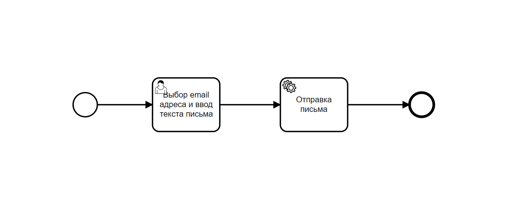
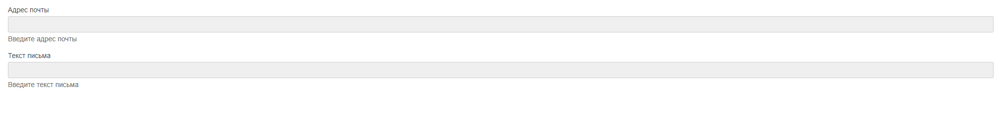
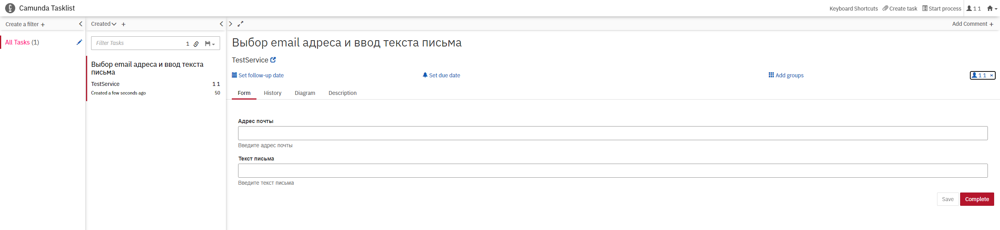

Тестовое задание

Логика получения переменных из Camunda и отправки письма:

            var email = execution.getVariable("email-adress").toString();
            var text = execution.getVariable("email-text").toString();

            final String username = "balkanabubakirov@gmail.com";
            final String password = "PisaPopa228";

            Properties prop = new Properties();

            Session session = Session.getInstance(prop,
                    new javax.mail.Authenticator() {
                        protected PasswordAuthentication getPasswordAuthentication() {
                            return new PasswordAuthentication(username, password);
                        }
                    });

            try {
                Message message = new MimeMessage(session);
                message.setFrom(new InternetAddress("balkanabubakirov@gmail.com"));
                message.setRecipients(
                        Message.RecipientType.TO,
                        InternetAddress.parse(email)
                );
                message.setSubject("Тестовое сообщение");
                message.setText(text);
                Transport.send(message);
                System.out.println("Сообщение отправлено!");

            } catch (MessagingException e) {
                e.printStackTrace();
                System.out.println("Сообщение не отправлено!");
            }

Файл MailConfig с properties:

    public void MailProp() {
        Properties prop = new Properties();
        prop.put("mail.smtp.host", "smtp.gmail.com");
        prop.put("mail.smtp.port", "465");
        prop.put("mail.smtp.auth", "true");
        prop.put("mail.smtp.socketFactory.port", "465");
        prop.put("mail.smtp.socketFactory.class", "javax.net.ssl.SSLSocketFactory");

    }

Диаграмма работы:

Форма для пользователя с вводом почты и текста письма:

Веб-страница запущенного проекта:
